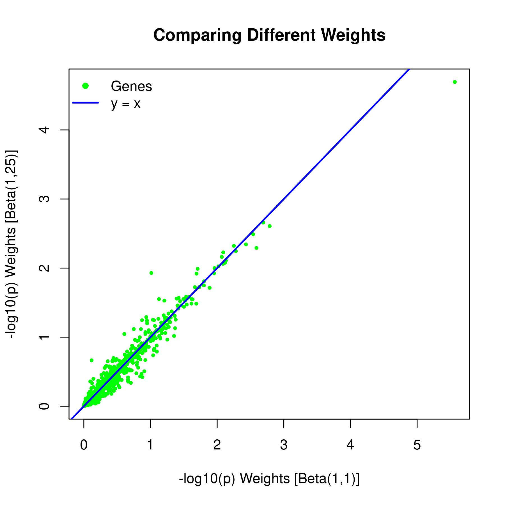

## Homework 5: Association analysis of Rare Variants and Sequence Data
### BS859 Applied Genetic Analysis
### Addison Yam
### February 25, 2026

Use the annotated imputed genotype gds files in `/projectnb/bs859/data/tgen/annotated_imputed_vcfs` (created from the gene annotated imputed genotype vcfs in the same directory) to complete this homework assignment.
The TGEN Alzheimer disease phenotype data are in tgen.psam, and the genetic relationship data are in grm.rel and grm.rel.id in the same directory. Use the principal component data in /projectnb/bs859/data/tgen/cleaned/TGEN_pcs.txt

```bash
# load the necessary modules
module load R 
#make an alias for the directory with the data
export DATADIR=/projectnb/bs859/data/tgen/annotated_imputed_vcfs/
```

```bash
# Ran this script during class for the MAF<=0.05
> Rscript SMMAT_tgenChr19Example.R > SMMAT_tgenChr19Example.log
> head -n 3 chr19.exonic05.csv 
group,n.variants,miss.min,miss.mean,miss.max,freq.min,freq.mean,freq.max,B.score,B.var,B.pval,S.pval,O.pval,O.minp,O.minp.rho,E.pval,cMAC
TOMM40,12,0,0,0,0.000209861440404175,0.00724076337140124,0.0424115729734367,35.28393575462,6078.13666637341,0.650853879365176,8.71613724681265e-06,1.99395622761944e-05,8.71613724681265e-06,0,2.02359063835369e-05,213.225999761024
ZNF154,11,0,0,0,0.000213121445701528,0.00565536787719618,0.0355309699452349,-69.2429321067421,5186.10064853721,0.33629449364828,0.00119336803065706,0.00233976427338201,0.00119336803065706,0,0.00219675753681785,152.661000477034

# copy the class's R script and edit it to reflect MAF<=0.01
cp SMMAT_tgenChr19Example.R SMMAT_tgenChr19Example_MAF01.R
vi SMMAT_tgenChr19Example_MAF01.R
```

Contents of the `SMMAT_tgenChr19Example_MAF01.R` script:
```r
##SMMAT gene-based tests for TGEN chromosome 19, topmed imputed data
##where R2>0.3
## 
library(GMMAT)
pheno<-read.table("/projectnb/bs859/data/tgen/annotated_imputed_vcfs/tgen.psam",
header=T,comment.char="")
colnames(pheno)<-c("FID","IID","sex","case")
pcs<-read.table("/projectnb/bs859/data/tgen/cleaned/TGEN_pcs.txt",
	header=T,as.is=T)

##already run:  converts vcf to gds format
#SeqArray::seqVCF2GDS("anno1.chr19.vcf.gz", "chr19.gds")
###
# merge the PC data with the fam file (pheno) data.

pheno1<-merge(pheno,pcs,by=c("FID","IID"),all.x=TRUE)

##Read in the GRM (genetic relationship matrix) -- I saved the one from
##last week to the same directory as the annotated vcfs:
grm<-as.matrix(read.table("/projectnb/bs859/data/tgen/annotated_imputed_vcfs/grm.rel",header=F))

# Read in the grm id file:
grm.ids<-read.table("/projectnb/bs859/data/tgen/annotated_imputed_vcfs/grm.rel.id",header=F)
#apply the IDs to the two dimensions of the grm.  This is how
#gmmat will know which row and column belongs to each ID

dimnames(grm)[[1]]<-dimnames(grm)[[2]]<-grm.ids[,2]

## Null model (PC covariates, no SNPs, logistic model)

model.0<-glmmkin(case-1~PC6+PC8,data=pheno1,id="IID",kins=grm,family=binomial("logit")) 

print("##check Null model coefficients for significance:")
coef<-model.0$coef
sd<-sqrt(diag(model.0$cov))
coef.pval<-pchisq((coef/sd)^2,1,lower.tail=F)
coef.table<-cbind(coef,sd,coef.pval)
coef.table

## Performs the SMMAT efficient score test for all of the groups
## of SNPs in the groups file.  Limits to variants with MAF<=0.01, and uses
## the MAF weights proposed by Wu et al.
###see documentation to understand the different choices here:
###https://www.rdocumentation.org/packages/GMMAT/versions/1.5.0/topics/SMMAT

chr19.exonic01<-SMMAT(model.0, 
     "/projectnb/bs859/data/tgen/annotated_imputed_vcfs/chr19.gds", 
     group.file="chr19.exonic.smmat.groups", 
     group.file.se = " ",
     meta.file.prefix = NULL, MAF.range = c(1e-7, 0.01),
     MAF.weights.beta = c(1, 25), miss.cutoff = 1,
     missing.method = "impute2mean", method = "davies",
     tests =c("O", "E"), rho = c(0, 0.1^2, 0.2^2, 0.3^2, 0.4^2,
     0.5^2, 0.5, 1), use.minor.allele = FALSE,
     auto.flip = FALSE, Garbage.Collection = FALSE,
     is.dosage = TRUE, ncores = 1, verbose = TRUE)

##Create a subset from the results only the gene-based tests that 
##include more than one variant
chr19.exonic01.nvargt1<-subset(chr19.exonic01,n.variants>1)

##Sort the results by p-value (smallest to largest)
chr19.exonic01.nvargt1<-chr19.exonic01.nvargt1[order(chr19.exonic01.nvargt1$E.pval),]

##Add a column called "cMAC" that is the cumulative minor allele count
##for each gene.  This is computed from the number of variants in the gene
##multiplied by the mean variant allele frequency multipleid
##by 2 times the number if individuals included in the test: 

chr19.exonic01.nvargt1$cMAC<-chr19.exonic01.nvargt1$n.variants*chr19.exonic01.nvargt1$freq.mean*length(model.0$id_include)*2

print("##print a summary of the results:")
summary(chr19.exonic01.nvargt1)

print("#print the first 5 rows (smallest 5 gene p-values)")
chr19.exonic01.nvargt1[1:5,]

print("#print a table of the number of genes with cMAC>=10")
print("#This can be used to apply a Bonferroni correction, since we")
print("#don't count gene-based tests where cMAC<10.")

table(chr19.exonic01.nvargt1$cMAC>=10)

print("#print the genes where the p-value is < bonferroni significance level")

sig.level<-0.05/table(chr19.exonic01.nvargt1$cMAC>=10)["TRUE"]
subset(chr19.exonic01.nvargt1,E.pval<=sig.level)

##write all the results to a comma delimited text file
write.csv(chr19.exonic01.nvargt1,"chr19.exonic01.csv",row.names=F,quote=F)
```

```bash
# Run the new R script for MAF<=0.01
Rscript SMMAT_tgenChr19Example_MAF01.R > SMMAT_tgenChr19Example_MAF01.log
```

1. Perform gene-based tests on exonic variants on chromosome 19 twice. Once restricting to MAF<=0.05 and once restricting to MAF<=0.01 for chromosome 19 (we did the MAF<=0.05 analysis in class). Use the same other parameters that we used in class. Fill in the table below with the results for b. through g. Don’t forget to also answer h!
a. Show your SMMAT call for the MAF<=0.01 version and explain what each of the parameters in the call is doing. Consult the SMMAT documentation!
- Answer: I go through each parameter and what they do
    - 'model.0' is the model we fitted earlier of covariates PC6 and PC8. - `chr19.gds` - the genotype file
    - `group.file="chr19.exonic.smmat.groups"`- says which exonic SNPs are associated with which genes
    - `group.file.se = " "` - the group file is space-delimited
    - `meta.file.prefix = NULL` - there are no meta analysis files
    - `MAF.range = c(1e-7, 0.01)` - range of only variants with MAF<=0.01
    - `MAF.weights.beta = c(1, 25)` - the type of beta distribution
    - `miss.cutoff` = 1 - rate for which missing rate, 1 is the largest so there is no missing filter applied
    - `missing.method = "impute2mean"` - Mean allele frequency is used for imputing the mssing genotypes
    - `method = "davies"` - davies method for calculating p-values
    - `tests = c("O", "E")` - O is for SKAT-O test and E is for SMMAT-E test
    - `rho = c(0, 0.1^2, 0.2^2, 0.3^2, 0.4^2, 0.5^2, 0.5, 1)` - correlation parameters for SKAT-O where the max and minimum are specified and what mixures in between
    - `use.minor.allele = FALSE` - use the ALT allele in the group file
    - `auto.flip = FALSE` - don't flip the strands
    - `Garbage.Collection = FALSE` - don't run garbage collection
    - `is.dosage` = TRUE - The genotypes are imputed dosages
    - `ncores` = 1 - how many cores for computatipn
    - `verbose = TRUE` - print the progress of this running to console
```r
# here is what the SMMAT call for the MAF<=0.01
chr19.exonic01<-SMMAT(model.0, 
     "/projectnb/bs859/data/tgen/annotated_imputed_vcfs/chr19.gds", 
     group.file="chr19.exonic.smmat.groups", 
     group.file.se = " ",
     meta.file.prefix = NULL, MAF.range = c(1e-7, 0.01),
     MAF.weights.beta = c(1, 25), miss.cutoff = 1,
     missing.method = "impute2mean", method = "davies",
     tests =c("O", "E"), rho = c(0, 0.1^2, 0.2^2, 0.3^2, 0.4^2,
     0.5^2, 0.5, 1), use.minor.allele = FALSE,
     auto.flip = FALSE, Garbage.Collection = FALSE,
     is.dosage = TRUE, ncores = 1, verbose = TRUE)
```
b. How many individuals were included in the analysis?
- Anwer: There are 1228 individuals included in the analysis
```bash 
wc -l /projectnb/bs859/data/tgen/annotated_imputed_vcfs/tgen.psam
1229 /projectnb/bs859/data/tgen/annotated_imputed_vcfs/tgen.psam
```
c. How many of the gene-based tests included only 1 variant?
- There are 0 gene-based tests including only 1 variant for MAF<=0.05 and 0 for MAF<=0.01
```r
# gets number of genes where there is only 1 variant
> table(res05$n.variants == 1)
FALSE 
 1509 

> table(res01$n.variants == 1)
FALSE 
 1485 
```
d. How many of the gene-based tests that include 2 or more variants have a cumulative minor allele count (cMAC)<10?
- Answer: There are 174 tests for MAF<=0.05 and 282 for MAF<=0.01 that include 2 or more variants and cMAC<10. For the table, there are 1335 for MAF<=0.05 and 1203 for MAF<=0.01 that include 2 or more variants and cMAC>=10/
```r
# gets number of genes with 2 or more variants
> res05_2plus <- subset(res05, n.variants > 1)
> res01_2plus <- subset(res01, n.variants > 1)

# gets those with a cMAC<10
> table(res05_2plus$cMAC >= 10)
FALSE  TRUE 
  174  1335 
> table(res01_2plus$cMAC >= 10)
FALSE  TRUE 
  282  1203 
```

e. To achieve a family wise error rate of 0.05, what Bonferroni-adjusted significance level should we use to determine significant gene associations, if we use just the SMMAT-E test, and only the genes with cMAC>=10 and at least 2 variants?
- Answer: For MAF<0.05, the Bonferroni-adjusted significance level we should use is 3.745318e-05. For MAF<0.01, we should use 4.156276e-05
```r
# get the number of genes with at least 2 variants and cMAC>=10
> n_tests05 <- sum(res05_2plus$cMAC >= 10, na.rm=TRUE)
> n_tests01 <- sum(res01_2plus$cMAC >= 10, na.rm=TRUE)

# get the Bonferroni-adjusted significance level
> bonf05 <- 0.05 / n_tests05
> bonf05
[1] 3.745318e-05
> bonf01 <- 0.05 / n_tests01
> bonf01
[1] 4.156276e-05

```

f. How many genes are significant by the SMMAT-E test? List them
- Answer: Only one gene is significant which is TOMM40 for MAF<=0.05 and no genes were found to be significant for MAF<=0.01
```r
> sig05 <- subset(res05_2plus, cMAC >= 10 & E.pval <= bonf05)
> sig01 <- subset(res01_2plus, cMAC >= 10 & E.pval <= bonf01)
> nrow(sig05)
[1] 1
> nrow(sig01)
[1] 0
> sig05$group
[1] "TOMM40"
> sig01$group
character(0)
```
g. Identify the most significant gene from SMMAT-E with MAF<0.05. For BOTH the MAF<0.05 and MAF<0.01 analysis, report the SMMAT-E p-value for that gene and gene cMAC in the table.
- Answer: The SMMAT-E p-value for TOMM40 for MAF<=0.05 is 2.023591e-05. and for MAF<=0.05, it is 0.377393.
```r
# Get the SMMAT-E and cMAC for TOMM40
> res05[res05$group == "TOMM40", c("group", "E.pval", "cMAC")]
   group       E.pval    cMAC
1 TOMM40 2.023591e-05 213.226
> res01[res01$group == "TOMM40", c("group", "E.pval", "cMAC")]
     group   E.pval   cMAC
537 TOMM40 0.377393 16.728

```
h. What do your observations in g. tell you about the variants that are driving that gene association?
- Answer: My observation in g tell me that the variants that are driving the gene association of TOMM40 are variants with MAF from 0.01 to 0.05 and not the variants with MAF less than 0.01 as the SMMAT-E p-value isn't significant for MAF <=0.01 and the cMAC is a lot smaller when MAF <=0.01 (16.728) compared to MAF <=0.05 (213.226). The variants with MAF from 0.01 to 0.05 are contributing towards AD, and the more rare variants with MAF<0.01 aren't contributing as much. 

|  | MAF<0.05 SNPs | MAF<0.01 SNPs |
|  ---  |   ----  | --- |
| b. Number of individuals in the analysis |  1228  | 1228  |
| c. Number of gene-based tests with only 1 variant included |  0  |  0 |
| d. Gene-based tests with >= 2 variants and cMAC>=10 |  1335  |  1203 |
| e. Bonferroni-adjusted significance level using only SMMAT-E, and genes with cMAC>=10 and >=2 genetic variants |  3.745318e-05  |  4.156276e-05 |
| f. Number of significant genes |  1 (TOMM40)  | 0 |
| g. What is the SMMAT-E p-value for the most significant gene from the MAF<0.05 SMMAT-E analysis? | 2.023591e-05  | 0.377393  |

2. Perform gene-based testing for the TGEN imputed data on chromosome 19, using a maximum allele frequency of 0.05 and flat weights (MAF.weights.beta=c(1,1)), so that all variants are equally weighted rather than up-weighting rarer variants.
```bash
# Copy the R script and edit it to reflect the new flat weight and the MAF<=0.05
cp SMMAT_tgenChr19Example.R SMMAT_tgenChr19Example_flatWeights.R
vi SMMAT_tgenChr19Example_flatWeights.R
```

Contents of the `SMMAT_tgenChr19Example_flatWeights.R` script
```r
##SMMAT gene-based tests for TGEN chromosome 19, topmed imputed data
##where R2>0.3
## 
library(GMMAT)
pheno<-read.table("/projectnb/bs859/data/tgen/annotated_imputed_vcfs/tgen.psam",
header=T,comment.char="")
colnames(pheno)<-c("FID","IID","sex","case")
pcs<-read.table("/projectnb/bs859/data/tgen/cleaned/TGEN_pcs.txt",
	header=T,as.is=T)

##already run:  converts vcf to gds format
#SeqArray::seqVCF2GDS("anno1.chr19.vcf.gz", "chr19.gds")
###
# merge the PC data with the fam file (pheno) data.

pheno1<-merge(pheno,pcs,by=c("FID","IID"),all.x=TRUE)

##Read in the GRM (genetic relationship matrix) -- I saved the one from
##last week to the same directory as the annotated vcfs:
grm<-as.matrix(read.table("/projectnb/bs859/data/tgen/annotated_imputed_vcfs/grm.rel",header=F))

# Read in the grm id file:
grm.ids<-read.table("/projectnb/bs859/data/tgen/annotated_imputed_vcfs/grm.rel.id",header=F)
#apply the IDs to the two dimensions of the grm.  This is how
#gmmat will know which row and column belongs to each ID

dimnames(grm)[[1]]<-dimnames(grm)[[2]]<-grm.ids[,2]

## Null model (PC covariates, no SNPs, logistic model)

model.0<-glmmkin(case-1~PC6+PC8,data=pheno1,id="IID",kins=grm,family=binomial("logit")) 

print("##check Null model coefficients for significance:")
coef<-model.0$coef
sd<-sqrt(diag(model.0$cov))
coef.pval<-pchisq((coef/sd)^2,1,lower.tail=F)
coef.table<-cbind(coef,sd,coef.pval)
coef.table

## Performs the SMMAT efficient score test for all of the groups
## of SNPs in the groups file.  Limits to variants with MAF<=0.05, and uses
## the MAF weights proposed by Wu et al.
###see documentation to understand the different choices here:
###https://www.rdocumentation.org/packages/GMMAT/versions/1.5.0/topics/SMMAT

chr19.exonic.flat<-SMMAT(model.0, 
     "/projectnb/bs859/data/tgen/annotated_imputed_vcfs/chr19.gds", 
     group.file="chr19.exonic.smmat.groups", 
     group.file.se = " ",
     meta.file.prefix = NULL, MAF.range = c(1e-7, 0.05),
     MAF.weights.beta = c(1, 1), miss.cutoff = 1,
     missing.method = "impute2mean", method = "davies",
     tests =c("O", "E"), rho = c(0, 0.1^2, 0.2^2, 0.3^2, 0.4^2,
     0.5^2, 0.5, 1), use.minor.allele = FALSE,
     auto.flip = FALSE, Garbage.Collection = FALSE,
     is.dosage = TRUE, ncores = 1, verbose = TRUE)

##Create a subset from the results only the gene-based tests that 
##include more than one variant
chr19.exonic.flat.nvargt1<-subset(chr19.exonic.flat,n.variants>1)

##Sort the results by p-value (smallest to largest)
chr19.exonic.flat.nvargt1<-chr19.exonic.flat.nvargt1[order(chr19.exonic.flat.nvargt1$E.pval),]

##Add a column called "cMAC" that is the cumulative minor allele count
##for each gene.  This is computed from the number of variants in the gene
##multiplied by the mean variant allele frequency multipleid
##by 2 times the number if individuals included in the test: 

chr19.exonic.flat.nvargt1$cMAC<-chr19.exonic.flat.nvargt1$n.variants*chr19.exonic.flat.nvargt1$freq.mean*length(model.0$id_include)*2

print("##print a summary of the results:")
summary(chr19.exonic.flat.nvargt1)

print("#print the first 5 rows (smallest 5 gene p-values)")
chr19.exonic.flat.nvargt1[1:5,]

print("#print a table of the number of genes with cMAC>=10")
print("#This can be used to apply a Bonferroni correction, since we")
print("#don't count gene-based tests where cMAC<10.")

table(chr19.exonic.flat.nvargt1$cMAC>=10)

print("#print the genes where the p-value is < bonferroni significance level")

sig.level<-0.05/table(chr19.exonic.flat.nvargt1$cMAC>=10)["TRUE"]
subset(chr19.exonic.flat.nvargt1,E.pval<=sig.level)

##write all the results to a comma delimited text file
write.csv(chr19.exonic.flat.nvargt1,"chr19.exonic.flat.csv",row.names=F,quote=F)
```
a. Omit the gene-based tests with only a single variant and with cMAC<10. How many genes remain?
- Answer: The number of genes that remain is 174 genes.
```r
# Load the results of the for when flat weights is (Beta 1,25) and (Beta 1,1)
> res_beta <- read.csv("chr19.exonic05.csv", as.is=TRUE)
> res_flat <- read.csv("chr19.exonic.flat.csv", as.is=TRUE)

# Get the genes with only a single variant
> res_beta_2plus <- subset(res_beta, n.variants > 1)
> res_flat_2plus <- subset(res_flat, n.variants > 1)

# Now with the previous variable, get the genes with cMAC<10
> table(res_beta_2plus$cMAC >= 10)
FALSE  TRUE 
  174  1335 
> table(res_flat_2plus$cMAC >= 10)
FALSE  TRUE 
  174  1335
```
b. Create a scatter plot -log10(p) for the SMMAT-E p-value for the flat weights versus the default MAFweights.beta=c(1,25) weights.
- Answer: I created the following scatter plot



```r
# based on gene name, merge the two variables  and rename the columns accordingly
merged <- merge(res_beta[, c("group", "E.pval", "cMAC")], 
                res_flat[, c("group", "E.pval")], 
                by="group", 
                suffixes = c(".beta", ".flat"))
> dim(merged)
[1] 1509    4

# keep genes where cMAC is >=10
> merged_power <- subset(merged, cMAC >= 10)
> dim(merged_power)
[1] 1335    4

# calculate the -log10(p) values
merged_power$logP_beta <- -log10(merged_power$E.pval.beta)
merged_power$logP_flat <- -log10(merged_power$E.pval.flat)

# Save the plot
jpeg("Weight_Flat.jpeg", width = 6, height = 6, units = "in", res = 300)

# Create a scatter plot where the x-axis is Beta(1,1) and y-axis is Beta(1,25)
plot(merged_power$logP_flat, 
     merged_power$logP_beta,
     xlab = "-log10(p) Weights [Beta(1,1)]",
     ylab = "-log10(p) Weights [Beta(1,25)]",
     main = "Comparing Different Weights",
     pch = 16,        # solid circles
     col = "green",     # blue points
     cex = 0.6)        # point size

# Add diagonal line and legend
abline(0, 1, col = "blue", lwd = 2)
legend("topleft", 
       legend = c("Genes", "y = x"),
       col = c("green", "blue"),
       pch = c(16, NA),
       lty = c(NA, 1),
       lwd = c(NA, 2),
       bty = "n")

dev.off()
```
c. Summarize and interpret your findings concerning the effect of the weighting scheme on the associations. What do your observations tell you about the most significant gene association?
- Answer: When I plot the differing weights Beta(1,1) and Beta(1,25), we see most of the points near the diagonal line which is used to help determine which genes have a more significant assocation in one weight than the other. I see one gene that is an outlier with extremely significant p-values at around (x=5.5, y=5) and is below the line closer to the x-axis of Beta(1,1) than the y-axis of Beta(1,25), so this means that that gene has more significance with Beta(1,1) than Beta(1,25). This gene is probably TOMM40 as we demonstrated TOMM40 as a significant gene from the first question. But most of the genes are near (x=1, y=1) with a slight shift closer to the y-axis of Beta(1,25), which means that in general, there is more significance with Beta(1,25) weights. 